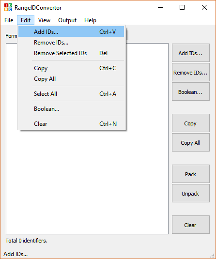
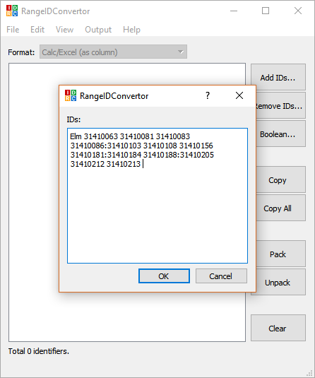
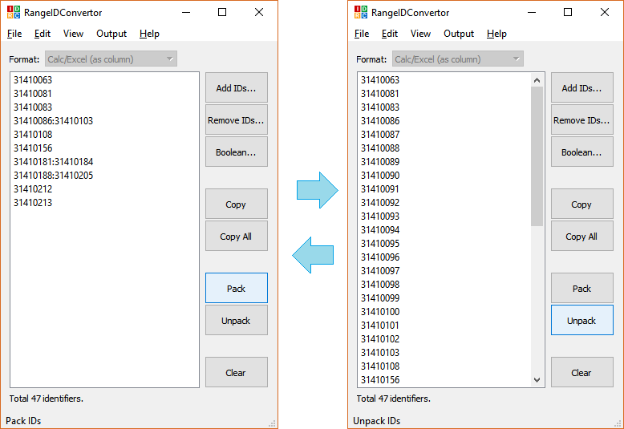
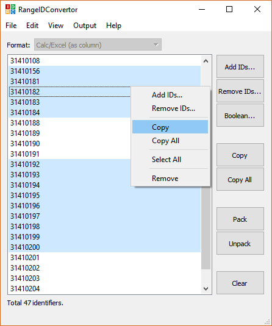
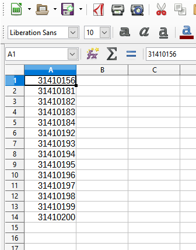

# Range ID Convertor

**RangeIDConvertor** is a solution for converting identifier ranges from [FEA](https://en.wikipedia.org/wiki/Finite_element_analysis "Finite Element Analysis (FEA)") softwares.

Basically, **it converts a range of identifiers** [1] (ex: node, element, material, .. property ID) from various formats used by *Patran*, *Femap*, *Abaqus*, *HyperMesh*, *Ansys*, *Calc* and *Excel*.

[1] See *glossary* at the end of this document

## Description

The current [FEA](https://en.wikipedia.org/wiki/Finite_element_analysis "Finite Element Analysis (FEA)") pre/post-processing tools and analysis tools in the market are known to use different formats for storing range of IDs.
Moreover, these ID ranges are often *packed*. This makes unpacking quite **unfriendly** and **error-prone**.

**RangeIDConvertor** makes conversions of range between these tools easier, and simplifies the ranges unpacking.

## What's the problem?

1. Copy a list of identifiers, let's say, from Patran:

        Elm 31276964 31276974 31276989:31277019:10 31277028 31277075 31280111:31280129:6 31292327

1. Paste it to Excel, as a column (replacing all 'spaces' by 'end-of-line' characters):

        1: 31276964
        2: 31276974
        3: 31276989:31277019:10
        4: 31277028
        5: 31277075
        6: 31280111:31280129:6
        7: 31292327

As you see here, some identifiers are *packed* (here, lines 3 and 6).

*D'oh!*

How to expand them quickly?

The solution is to paste the identifiers in **RangeIDConvertor**.

- RangeIDConvertor expands all the ID ranges.
- RangeIDConvertor converts them to the format of a specific tool.

## Installation

Download the most recent package from the [download](https://github.com/setvisible/range-id-convertor/releases "Last Releases") page, unzip it and run it.

## Usage

Just copy-n-paste.

### Quick tutorial

1) **Add** the IDs

2) Paste the IDs from your favorite pre/post-processing tool

3) Click **Pack** or **Unpack** to choose the output format

4) Select and copy the IDs (with **Copy** or *Ctrl+C*)

6) Paste them to another pre/post-processing tool (with *Ctrl+V*)

## Format diversity

This section presents different formats, often encountered by stress analysts.

Remark: In the following examples, we consider the same list of identifiers: `100, 101, 102, 109, 110, 115, 123, 131` and demonstrate how the FEM softwares read them and the format diversity.

### Nastran Bulk File Format

 - from the Nastran file (comma-separated format):

        100,THRU,102,109,110,115,THRU,131,BY,8

 - from the Nastran file (small field format with continuation):

                                             100    THRU     102     109+
        +            110     115    THRU     131    STEP       8  EXCEPT+
        +            130

### Patran Format

 - from the GUI:

        Node 100:102 Elm 109 110 MPC 115:131:8

 - from the GUI (another format):

        n 100:102 e 109 110 MPC 115:131:8

### Patran Session File Format

 - from the *.ses group file :

        ga_group_create( "My group" )
        ga_group_entity_add( "My group", " Node 100:102 " // @
        "109 110 115 123 " // @
        "131") // @

### Femap Format

 - from the GUI:

        100,101,102,109,110,115,123,131

 - from the GUI (another format):

        100:102,109,110,115:131:8

 - from the GUI (another format):

        102:100:-1,109,110,131:115:-8

### HyperMesh Format

 - from the GUI:

        "el 100,101,102,109,110,115,123,131"

 - from the GUI (another format):

        "el 100-102,109-110,115,123,131"

### Abaqus Format

 - from the *.inp file:

        **
        *ELEMENT,TYPE=S4,ELSET=MY_ELEMENTS_PROP
            100,       101,       102,       109,       110
            110,       115,       123,       131**NAME MY_ELEMENTS_PROP
        *
        **

### Calc / Excel Format

 - by row:

         "100";"101";"102";"109";"110";"115";"123";"131";

- by column:

        "100"
        "101"
        "102"
        "109"
        "110"
        "115"
        "123"
        "131"

## Build

1. Download `rangeidconvertor-src.tar.gz`.

2. Unzip:

        $ tar zxvf rangeidconvertor-src.tar.gz
        $ cd rangeidconvertor-src/

3. Build with [QtCreator](https://qt-project.org/ "https://qt-project.org/").

     Compile and run `RangeIDConvertor.pro`.

## Deployment

### Windows

To deploy the application on Windows, we must make sure that the relevant DLLs and the executable are in the same directory.

1. Go to the `Release` build directory.

        $ mkdir RangeIDConvertor-v1.0-win32-release
        $ cd .\RangeIDConvertor-v1.0-win32-release
        $ cp D:\path\to\RangeIDConvertor.exe .\

2. Use the [Qt's Windows Deployment Tool](https://qt-project.org/qtdoc/570/windows-deployment.html#the-windows-deployment-tool "https://qt-project.org/qtdoc/570/windows-deployment.html#the-windows-deployment-tool").

        $ windeployqt .\

3. Zip and publish.

        $ tar RangeIDConvertor-v1.0-win32-release/

## Glossary

- **identifier** or **ID**: numerical value representing a unique entity
  (ex: a node, an element, a property, -etc.-).
  Ex : "5001987".

- **range**: sequence of identifiers.
  A range can be *packed* (ex: "5:9") or *unpacked* (ex: "5 6 7 8 9").

- **unpacking**: conversion of a *packed* range (ex: "5:9") to an *unpacked* range (ex: "5 6 7 8 9"), and vice versa.

- **interval**: range with a step (ex: "200:300:15").

## License

The code is released under the [MIT License](LICENSE "LICENSE").
